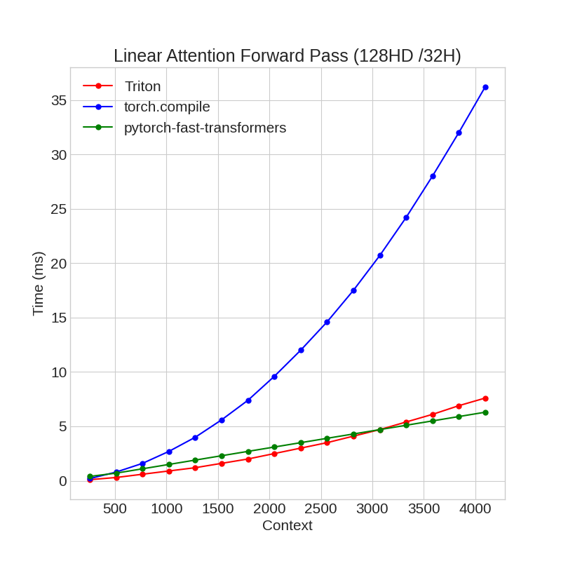
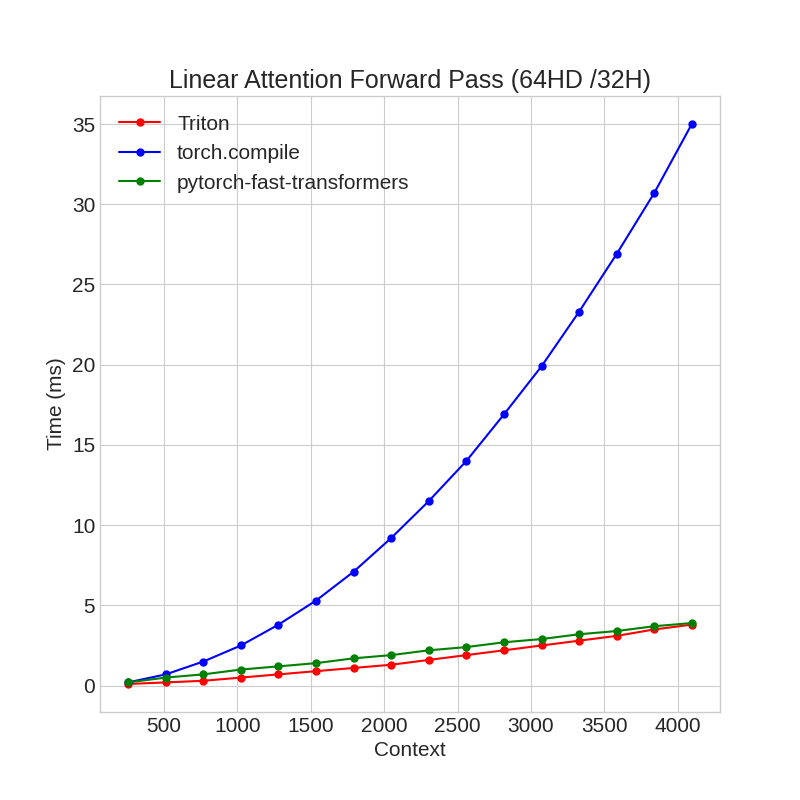
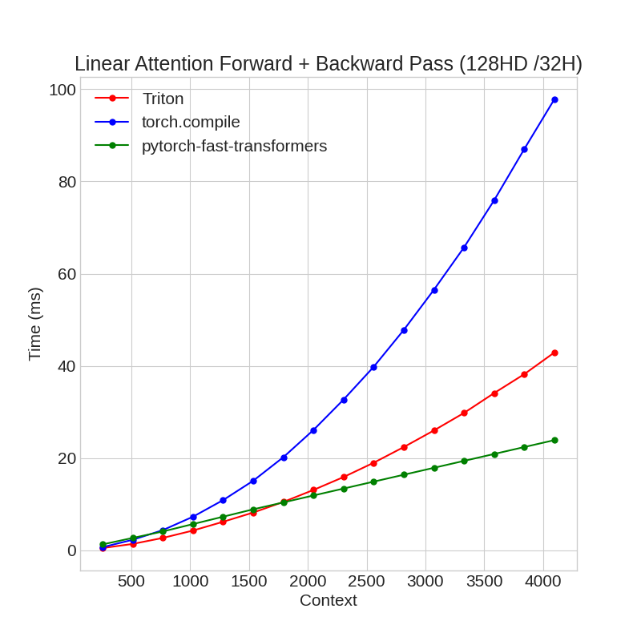
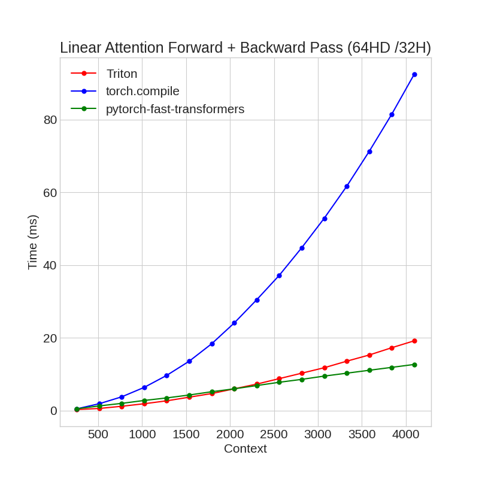

# Flashy Linear Attention

Forward and backward Triton kernels implementing linear attention in the style of [Flash Attention](https://arxiv.org/abs/2205.14135). Also Includes a kernel where query and key tensors have a different head dimension, intended to be used with Taylor Series Linear Attention as introduced [here](https://hazyresearch.stanford.edu/blog/2023-12-11-zoology2-based).

## Installation

```
git clone https://github.com/fattorib/flashy_linear_attention
cd flashy_linear_attention
pip install .
```

**Note**: As of January 2024, Triton 2.2.0 offers better performance than the pre-installed Triton 2.1.0 that comes with PyTorch 2.1.x. After installing ```flashlinear``` you can manually upgrade Triton after with:
```bash 
pip install -U triton==2.2.0
```
Pip might complain that PyTorch doesn't support Triton 2.2.0, but it does. 


## Use

A full linear attention implementation would include denominator scaling. There aren't huge speed/memory gains to be had from fusing this in (and it also makes the fused backward pass more complicated) so we leave it to PyTorch:

```python
from flashlinear import LinearAttention

def triton_linear_attention(q: torch.Tensor, k: torch.Tensor, v: torch.Tensor, eps = 1e-5):
    qkv_out = LinearAttention.apply(q, k, v)
    denom = (q * k.cumsum(-2)).sum(dim=-1, keepdim=True) + eps
    return qkv_out / (denom)
```

If you want to perform linear attention where the queries and keys have a larger dimensionality than the values, you can use ```LinearAttentionSmallVHD```:

```python
from flashlinear import LinearAttentionSmallVHD

def triton_linear_attention(q: torch.Tensor, k: torch.Tensor, v: torch.Tensor, eps = 1e-5):
    qkv_out = LinearAttentionSmallVHD.apply(q, k, v)
    denom = (q * k.cumsum(-2)).sum(dim=-1, keepdim=True) + eps
    return qkv_out / (denom)
```

## Benchmarks
Compared against naive linear attention wrapped with ```torch.compile``` and ```CausalDotProduct``` from ```fast-transformers```.

**Forward:**




**Forward+Backward:**



Further optimization and tuning is needed to reach optimal performance, but this kernel is fast enough for now. 

## Tests

```bash
pytest flashlinear/test_*
```

## References

```
@misc{katharopoulos2020transformers,
      title={Transformers are RNNs: Fast Autoregressive Transformers with Linear Attention}, 
      author={Angelos Katharopoulos and Apoorv Vyas and Nikolaos Pappas and François Fleuret},
      year={2020},
      eprint={2006.16236},
      archivePrefix={arXiv},
      primaryClass={cs.LG}
}
```

```
@misc{dao2022flashattention,
      title={FlashAttention: Fast and Memory-Efficient Exact Attention with IO-Awareness}, 
      author={Tri Dao and Daniel Y. Fu and Stefano Ermon and Atri Rudra and Christopher Ré},
      year={2022},
      eprint={2205.14135},
      archivePrefix={arXiv},
      primaryClass={cs.LG}
}
```

```
@misc{buckman2024,
  author = {Buckman, Jacob and Gelada, Carles},
  publisher = {Manifest AI},
  title = {Linear {Transformers} {Are} {Faster} {After} {All}},
  date = {2024-01-05},
  langid = {en}
}
```
